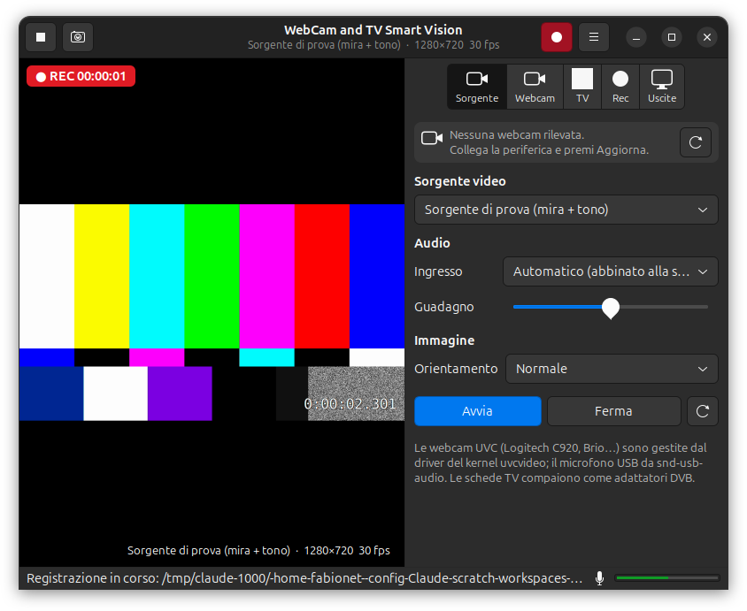

# WebCam and TV Smart Vision

[](https://github.com/fabionet/webcam-tv-smart/actions/workflows/build-deb.yml)

Applicazione GNOME (GTK3 + GStreamer, interamente in C++17) per webcam UVC come la
**Logitech C920 / C920 HD Pro / C922 / Brio 4K**, schede **TV digitali terrestri, via cavo e
satellitari (DVB)** e flussi di rete. Finestra principale 800×600 con header bar in stile GNOME.
Funziona su **Debian 12/13, Ubuntu 22.04/24.04 e derivate** (Linux Mint, Pop!_OS, Zorin, elementary, MX…).



📘 **[Guida illustrata in PDF](docs/Guida-WebCam-TV-Smart-Vision.pdf)**

## Funzioni

| Area | Cosa fa |
|------|---------|
| Sorgente | Nome della periferica di cattura rilevata (es. *HD Pro Webcam C920*) con tasto **Aggiorna**; selettore webcam V4L2 / adattatori DVB / URL rtsp-http-file / mira di prova; formato-risoluzione-fps; ingresso audio abbinato automaticamente al microfono della webcam; guadagno; specchiatura/rotazione |
| Webcam | Tutti i controlli V4L2 esposti dal driver (luminosità, contrasto, saturazione, zoom, pan/tilt, messa a fuoco, esposizione, bilanciamento del bianco, anti-sfarfallio 50/60 Hz…) più profili rapidi (Auto, 50 Hz, Fuoco fisso) |
| TV e satellite | Elenco canali da `channels.conf` (formato zap o DVBv5), scansione con `dvbv5-scan`, sintonia manuale (DVB-T/T2/C/S/S2, frequenza, banda, symbol rate, polarità) |
| Rec | Registrazione audio+video in **MP4 (H.264 + AAC)** o **OGG (Theora + Vorbis)**, bitrate regolabili, istantanee PNG, cartella e prefisso file |
| Uscite | Ponte del segnale passante verso un **dispositivo video V4L2** (v4l2loopback o uscita hardware), verso una **uscita audio** (HDMI, cuffie, ecc.) e verso una **finestra esterna** da mettere a schermo intero su un secondo monitor/TV |

Se nessuna webcam è collegata l'area video mostra **"Nessuna periferica di cattura rilevata"** con il
tasto **Cerca dispositivi**; appena colleghi la webcam viene riconosciuta e avviata da sola (hot-plug).

Scorciatoie: `Ctrl+R` registra, `Ctrl+S` istantanea, `F11` schermo intero, `Esc` esce dallo schermo intero.

## Installazione dal pacchetto .deb

Scarica dalla pagina [Releases](https://github.com/fabionet/webcam-tv-smart/releases) il pacchetto
per la tua distribuzione e installalo con apt, che risolve da solo le dipendenze:

| Distribuzione (e derivate) | Pacchetto |
|---|---|
| Debian 12 "bookworm" (MX 23, …) | `webcam-tv-smart-vision_<ver>_debian12_amd64.deb` |
| Debian 13 "trixie" | `webcam-tv-smart-vision_<ver>_debian13_amd64.deb` |
| Ubuntu 22.04 (Mint 21, Pop!_OS 22.04, Zorin 17, elementary 7, …) | `webcam-tv-smart-vision_<ver>_ubuntu22.04_amd64.deb` |
| Ubuntu 24.04 (Mint 22, …) | `webcam-tv-smart-vision_<ver>_ubuntu24.04_amd64.deb` |

```bash
sudo apt install ./webcam-tv-smart-vision_*_amd64.deb
```

I pacchetti vengono compilati da GitHub Actions dentro container ufficiali di ogni distribuzione
(`.github/workflows/build-deb.yml`), così le dipendenze (glibc, GTK, GStreamer) sono quelle giuste
per ciascuna. Per produrne uno in locale per un'altra distro: `packaging/build-deb-in-container.sh debian:12`.

## Driver per la Logitech C920

Non serve alcun driver aggiuntivo: la C920 è una webcam **UVC** (USB Video Class) e il kernel Linux la
gestisce nativamente con due moduli presenti in ogni distribuzione:

- `uvcvideo` → video (`/dev/videoN`, controlli V4L2)
- `snd-usb-audio` → microfono stereo USB (via PipeWire/PulseAudio)

La C920 è una webcam **1080p**; il modello Logitech 4K è la **Brio**, anch'essa UVC e gestita allo stesso modo.
Il pacchetto include una regola udev facoltativa che crea il link stabile `/dev/webcam-c920` e imposta i
valori consigliati (50 Hz, esposizione automatica, autofocus) a ogni collegamento:

```bash
sudo cp /usr/share/webcam-tv-smart-vision/99-logitech-c920-smartvision.rules /etc/udev/rules.d/ && sudo udevadm control --reload
```

## Compilazione dai sorgenti

```bash
sudo apt install build-essential cmake ninja-build pkg-config libgtk-3-dev \
  libgstreamer1.0-dev libgstreamer-plugins-base1.0-dev \
  gstreamer1.0-x gstreamer1.0-plugins-good gstreamer1.0-plugins-bad gstreamer1.0-plugins-ugly \
  gstreamer1.0-libav gstreamer1.0-gtk3 gstreamer1.0-pipewire \
  v4l-utils dvb-tools v4l2loopback-dkms
```

```bash
git clone https://github.com/fabionet/webcam-tv-smart.git && cd webcam-tv-smart && ./build.sh
```

| Comando | Effetto |
|---|---|
| `./build.sh` | compila in `build/` |
| `./build.sh install` | installa in `/usr/local` (menu GNOME, icona, manuale) |
| `./build.sh deb` | crea il pacchetto `.deb` per la distro in uso in `dist/` |
| `./build/webcam-tv-smart-vision --self-test /tmp/sv` | auto-test senza hardware: mira di prova, MP4 e OGG di ~4 s, istantanea, schermate |

Requisiti minimi: GTK 3.22, GStreamer 1.16, GLib 2.56, compilatore C++17.

## Ponte del segnale (uscite)

1. **Video → V4L2**: nella pagina *Uscite* premi *Crea dispositivo virtuale…* (carica `v4l2loopback`
   con `pkexec`, compare `/dev/video10` "SmartVision Output"), scegli il dispositivo e attiva
   l'interruttore. Browser, OBS e videoconferenze vedranno il segnale come una webcam.
2. **Audio → uscita hardware**: scegli il sink (HDMI, cuffie, altoparlanti) e attiva; volume e muto
   agiscono solo sul ponte, non sulla registrazione.
3. **Finestra esterna**: apre una seconda finestra con lo stesso flusso; trascinala sul monitor o TV
   collegato in HDMI e premi `F11`.

## Struttura del codice

```
src/main.cpp            avvio GtkApplication, opzioni --self-test / --version
src/app_window.*        finestra principale, pagine, azioni, auto-test
src/pipeline.*          pipeline GStreamer: sorgente → tee → anteprima / registrazione / uscite
src/device_manager.*    enumerazione V4L2, DVB, audio (GstDeviceMonitor), hot-plug
src/v4l2_device.*       ioctl V4L2: formati, controlli, informazioni del dispositivo
src/dvb.*               adattatori DVB (FE_GET_INFO), lettura channels.conf, sistemi di trasmissione
src/settings.*          impostazioni persistenti (~/.config/webcam-tv-smart-vision/settings.ini)
data/                   .desktop, icona SVG, metainfo, manuale, changelog, regola udev e script C920
docs/                   guida PDF, sorgente HTML della guida, schermate
packaging/              script per compilare il .deb in un container di un'altra distro
.github/workflows/      compilazione e pubblicazione dei .deb per ogni distribuzione
```

## Licenza

GPL-3.0-or-later — © 2026 Fabio Avallone.
